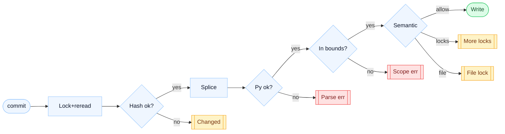
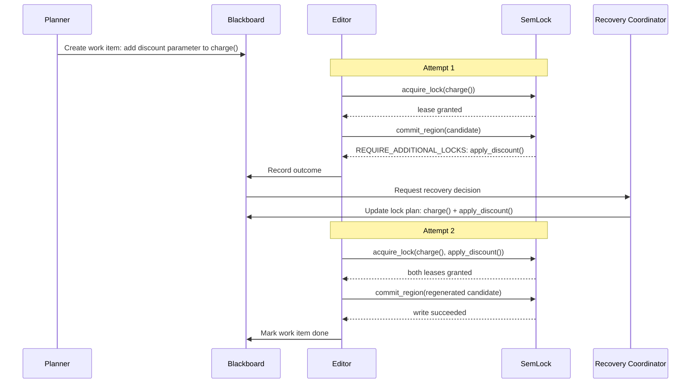

# SemLock: Region-Level Locking for Multi-Agent Code Editing

> Why Git breaks for AI agents — and how we fix it

## Inspiration

Having been using AI for my development work for the past few months, I have always been intrigued by multi-agent systems where multiple agents take on different tasks and edit code in the repository simultaneously.

But one thing irked me each time. That was when two agents tried to edit two things that are in the same file but are completely unrelated to each other, often times there will be silent errors where the agent will fail and retry later.

As I was reading up on database concurrency (specifically row-level locking and MVCC), I realised that databases had been solving this exact problem for decades using multiple writers, shared state, MVCC etc. The concepts were all there but it hadn't been applied to code agents.

And so I built SemLock. It's a small coordination layer that brings region-level locking to multi-agent Python editing.

Honestly, I only scraped the tip of the iceberg for this issue but I felt like I learnt a lot and wanted to share my thought processes with those that might be interested. So here goes: What I tried, what I learned and what I most definitely got wrong

## Problem

The first thing that comes to everyone's minds when we talk about multi-agent orchestration will be: hey why don't you just create a worktree for each of the tasks. That's very safe as the agents are isolated meaning there won't be any conflict and no one will step on each other.

I largely agree with this. Worktrees are great, they keep things clean and separated. But one thing I find rather contentious is that there are still conflicts and it is just pushed back to fixing during merge time. At the end, someone (god bless that poor soul) or something (good ol' claude) will have to reconcile all these changes before merging.

These reconciliations aren't cheap though. With agents spinning out tens of PRs in parallel, we're not just dealing with text conflicts but semantic ones too: Agent A restructured the module, Agent B added a feature against the old structure, and now reconciling them requires understanding what both agents actually intended.

In this agentic-driven development world, codebases move very fast and agents need to be working with each other's latest changes as an agent making decisions on a stale version of the codebase will produce edits that conflict or simply don't make sense in context.

Second obvious solution will be: when Agent A is writing, the whole file is locked. Once it is done, it releases it allowing Agent B to make edits on the file. Just like Serializable Concurrency in Databases.

The issue is we lose all the parallelism we are interested in. Visualise this example: If Agent A is editing process_payment() and Agent B wants to edit send_notification() (two completely unrelated functions in the same file), why should B wait for A? There's no actual conflict. Serialising at the file level treats every function as if it's the same function.

<div class="semlock-table-wrap">
  <table class="semlock-table">
    <thead>
      <tr>
        <th>Approach</th>
        <th>Parallelism</th>
        <th>Conflict handling</th>
      </tr>
    </thead>
    <tbody>
      <tr>
        <td><strong>Worktrees</strong></td>
        <td><span class="semlock-badge semlock-badge--success">Full</span></td>
        <td><span class="semlock-badge semlock-badge--danger">Deferred to merge time</span></td>
      </tr>
      <tr>
        <td><strong>File-level lock</strong></td>
        <td><span class="semlock-badge semlock-badge--danger">None</span></td>
        <td>
          <span class="semlock-badge semlock-badge--success">No conflicts</span>
          <span class="semlock-muted">but no parallelism</span>
        </td>
      </tr>
      <tr class="semlock-table__highlight">
        <td><strong>SemLock ✦</strong></td>
        <td><span class="semlock-badge semlock-badge--accent">Within-file</span></td>
        <td><span class="semlock-badge semlock-badge--accent">Caught at write time</span></td>
      </tr>
    </tbody>
  </table>
</div>

What we actually want is this: agents work in parallel when their edits don't overlap, and when they do overlap, you get a clean structured signal that tells the agent exactly what went wrong and what to do next.

That's what SemLock tries to do. Sounds simple right? Unfortunately, I found out that there's a lot more rabbit holes than I thought the hard way...

## Region Discovery

Before we start locking, the most important question is what is being locked.

We don't want it too coarse as we lose all the parallelism and we are back to agents waiting on each other to finish but we also don't want it too granular as we lose any meaningful semantic boundary.

My first idea was locking by line numbers. Parse the whole file storing the functions and what line number it starts from and ends on.

But this is very brittle. The moment another agent commits a change above your target function, all your line numbers shift. You would need to update your lock and recheck each reference. Sounds very very very painful

Second contender was locking by function names. This seems better than locking by line numbers and more scalable.

But there is one key problem: Python allows duplicate top-level names. So we won't be accurately locking by function name either.

We kinda need something that identifies a region in a current file and tells us which bytes it occupies. Using bytes is not brittle because the byte offsets are re-discovered fresh every time by parsing the current file. We never store them permanently and trust they'll still be valid later.

How do we define a region? A region needs to be uniquely identifiable, locatable, and verifiable, which is why it has these 4 fields:

1. A stable string ID, encoded as `kind::file_path::qualified_name`. For example `top_level_function::billing.py::charge`. If there are two functions with the same name, the second gets a numeric suffix: `top_level_function::billing.py::charge::1`. This way you can always target a specific one even when names collide.
2. Byte offsets: exactly where this region starts and ends in the current file.
3. A region kind: top_level_function, top_level_class, shared_header, or file.
4. A content hash: a hash of the bytes in this region right now.

The content hash is used to detect when the file changed under you: if the bytes in your region shifted since you last read them, the hash won't match and you'll get a clean signal to go re-read the file. You're not trusting position, you're trusting content.

All these 4 fields combine to form a key part of our system: `RegionDescriptor`

There's also a cache sitting underneath all of this, keyed on the exact file bytes. If you call `list_regions` twice on a file that hasn't changed, the second call returns immediately with no re-parse.

Once a commit succeeds, the cache is seeded with the new parsed state, so the next read is instant too.

How do we identify these regions? We make use of a particularly useful library called tree-sitter. Using this library, we can parse the python files into a syntax tree and walk through this tree to identify the regions.

Since it operates on raw bytes, it gives us exact byte offsets for every node in the tree, which is what you need when you're going to splice content in and out of a file.

Secondly, tree-sitter has the ability to parse files that are syntactically broken. Agents produce broken Python all the time: mid-edit, mid-refactor, a file might not parse cleanly. tree-sitter handles this gracefully.

What are the different kinds of regions we can have?

1. top_level_function: a top-level function and its decorators
2. top_level_class: a top-level class and its decorators
3. shared_header: everything from the top of the file to the first function or class: imports, module-level constants, docstrings.
4. file: the entire file. This is the escape hatch for changes too broad for anything narrower.

<div class="semlock-regions">
  <div class="semlock-region semlock-region--header">shared_header</div>
  <div class="semlock-region-line semlock-region-line--header">import stripe</div>
  <div class="semlock-region-line semlock-region-line--header">from decimal import Decimal</div>
  <div class="semlock-region-line semlock-region-line--header">TAX_RATE = 0.08</div>
  <div class="semlock-region-spacer"></div>
  <div class="semlock-region semlock-region--success">top_level_function: charge()</div>
  <div class="semlock-region-line semlock-region-line--success">def charge(amount: Decimal, customer_id: str) -&gt; dict:</div>
  <div class="semlock-region-line semlock-region-line--success">&nbsp;&nbsp;&nbsp;&nbsp;total = amount * (1 + TAX_RATE)</div>
  <div class="semlock-region-line semlock-region-line--success">&nbsp;&nbsp;&nbsp;&nbsp;return stripe.charge(amount=total, customer=customer_id)</div>
  <div class="semlock-region-spacer"></div>
  <div class="semlock-region semlock-region--warning">top_level_class: PaymentProcessor</div>
  <div class="semlock-region-line semlock-region-line--warning">class PaymentProcessor:</div>
  <div class="semlock-region-line semlock-region-line--warning">&nbsp;&nbsp;&nbsp;&nbsp;def __init__(self):</div>
  <div class="semlock-region-line semlock-region-line--warning">&nbsp;&nbsp;&nbsp;&nbsp;&nbsp;&nbsp;&nbsp;&nbsp;self.history = []</div>
  <div class="semlock-region-spacer"></div>
  <div class="semlock-region semlock-region--danger">top_level_function: apply_discount()</div>
  <div class="semlock-region-line semlock-region-line--danger">def apply_discount(amount: Decimal, pct: float) -&gt; Decimal:</div>
  <div class="semlock-region-line semlock-region-line--danger">&nbsp;&nbsp;&nbsp;&nbsp;return amount * (1 - pct)</div>
</div>

Just a note: in v1, we currently don't support methods inside classes, nested functions, or arbitrary blocks of statements. The boundaries get harder to enforce cleanly at that granularity and the added complexity wasn't worth it for a first version.

## Leases

Knowing what regions we have solves the first part of the problem. But how do we synchronise the changes?

Here is the problem: two agents can both call `list_regions` on the same file at the same time. Both see that `charge()` is available. Both decide to edit it. Both start building their replacement. Neither knows the other is doing the same thing.

This is famously known as the time-of-check/time-of-use problem (TOCTOU). The window between "I saw it was free" and "I'm writing to it" is exactly where it all falls apart.

Good news: this is a solved problem. Bad news: nobody solved it for code agents yet. Databases deal with it with row locks. Operating systems deal with it with mutexes. SemLock deals with it with leases.

<div class="semlock-compare">
  <div class="semlock-panel semlock-panel--danger">
    <div class="semlock-panel__title">✗ Without leases</div>
    <div class="semlock-panel__body">
      <div class="semlock-event">
        <div class="semlock-event__dot semlock-event__dot--agent-a"></div>
        <div>
          <div class="semlock-event__agent semlock-event__agent--agent-a">Agent A</div>
          <div class="semlock-event__text">reads <code>charge()</code> and sees it free</div>
        </div>
      </div>
      <div class="semlock-event">
        <div class="semlock-event__dot semlock-event__dot--agent-b"></div>
        <div>
          <div class="semlock-event__agent semlock-event__agent--agent-b">Agent B</div>
          <div class="semlock-event__text">reads <code>charge()</code> and also sees it free</div>
        </div>
      </div>
      <div class="semlock-callout">
        <div class="semlock-callout__title">Danger zone</div>
        <div class="semlock-callout__text">Both agents are building edits against the same baseline. Neither knows about the other.</div>
      </div>
      <div class="semlock-event">
        <div class="semlock-event__dot semlock-event__dot--agent-a"></div>
        <div>
          <div class="semlock-event__agent semlock-event__agent--agent-a">Agent A</div>
          <div class="semlock-event__text semlock-status semlock-status--success">writes <code>charge()</code> successfully</div>
        </div>
      </div>
      <div class="semlock-event">
        <div class="semlock-event__dot semlock-event__dot--agent-b"></div>
        <div>
          <div class="semlock-event__agent semlock-event__agent--agent-b">Agent B</div>
          <div class="semlock-event__text semlock-status semlock-status--danger">writes <code>charge()</code> and silently overwrites A</div>
        </div>
      </div>
    </div>
  </div>
  <div class="semlock-panel semlock-panel--success">
    <div class="semlock-panel__title">✓ With leases</div>
    <div class="semlock-panel__body">
      <div class="semlock-event">
        <div class="semlock-event__dot semlock-event__dot--agent-a"></div>
        <div>
          <div class="semlock-event__agent semlock-event__agent--agent-a">Agent A</div>
          <div class="semlock-event__text semlock-status semlock-status--success">acquires <code>charge()</code> and gets the lease</div>
        </div>
      </div>
      <div class="semlock-event">
        <div class="semlock-event__dot semlock-event__dot--agent-b"></div>
        <div>
          <div class="semlock-event__agent semlock-event__agent--agent-b">Agent B</div>
          <div class="semlock-event__text semlock-status semlock-status--danger">tries to acquire <code>charge()</code> and hits <code>LOCK_CONFLICT</code></div>
        </div>
      </div>
      <div class="semlock-event">
        <div class="semlock-event__dot semlock-event__dot--agent-a"></div>
        <div>
          <div class="semlock-event__agent semlock-event__agent--agent-a">Agent A</div>
          <div class="semlock-event__text semlock-status semlock-status--success">commits the edit and releases the lease</div>
        </div>
      </div>
      <div class="semlock-event">
        <div class="semlock-event__dot semlock-event__dot--agent-b"></div>
        <div>
          <div class="semlock-event__agent semlock-event__agent--agent-b">Agent B</div>
          <div class="semlock-event__text semlock-status semlock-status--success">retries, gets the lease, and reads fresh state</div>
        </div>
      </div>
    </div>
  </div>
</div>

What is a lease? A lease is server-issued proof that you have exclusive write permission for a specific region right now. The server has checked, granted you the lock, and will reject any other agent that tries to acquire the same region until your lease is released or expires.

By default, leases expire after 30 seconds. Each lease comes with four things: a `lease_token` (used in every subsequent call: get_region, commit_region, and release_lock), an `agent_id` (which agent holds it), an `expires_at` timestamp (so abandoned locks eventually clear themselves), and an `acquisition_id` that links together all regions you acquired in the same atomic request.

That last one is handy when you need to inspect or debug a multi-region acquisition.

One thing worth knowing about expiry: leases aren't actively monitored by a background timer. SemLock instead sweeps for expired leases whenever a new request comes in.

The practical implication is that a crashed agent's lock might sit around a bit longer than its TTL if no other requests happen to trigger the sweep. If an agent is still working on a complex change and needs more time, it calls `heartbeat_lock` to reset the TTL and keep the lease alive.

Atomicity is paramount. Here's why: if you need to edit both charge() and apply_discount(), you acquire both in a single request. The acquisition is atomic: you either get both locks or you get neither. There's no state where you hold charge() but not apply_discount().

Partial lock state is worse than no lock state, because it's hard to reason about and easy to deadlock on.

Under the hood, the LockManager keeps four separate indexes: token to lease, region ID to active token, file path to all active tokens on that file, and agent ID to all held regions. This means checking whether a region is already locked is a single dict lookup. The atomic multi-region acquisition works by running all the conflict checks upfront before granting any of them. If any of the N requested regions conflicts, none are granted.

So what are the rules around which locks conflict? Narrow region locks (individual functions and classes) only conflict if they're the exact same region. Two agents can hold locks on different functions in the same file at the same time, which is the whole point.

But shared_header and file locks are file-wide. They conflict with every other lock in the same file. If anyone holds a file lock on billing.py, nobody else can acquire anything in billing.py until that lock is released. Makes sense when you think about it: imports and constants sit in the header and everything in the file depends on them.

Here's the downside of the lease model though: they are in-memory only. So this means if SemLock server goes down, all the states of all our locks are gone :/

However, this is a conscious design choice. With the locks in-memory, our SemLock implementation is very simple and fast. We also get to avoid the can of worms called persisted lock recovery.

But this essentially means we are throwing the work for another layer to solve. We will go more into detail in the orchestration layer.

## Commit Validation

So we have the lease and we have the change to the file. What happens now? We need to commit this change to the file. Easy right? Not exactly.

It turns out this was one component I spent the longest designing and writing. The reason being that one of the most important things for this application is the correctness of the writes. We really want to avoid stale reads and overwrites.

Here's what actually happens under the hood.



**Hash Check**. This is very important as we don't want to write to a region that has been changed. To do this check, the server re-reads the file from disk and resolves the locked region from the current file state and computes its hash. Then it compares that hash against the `expected_region_hash` you sent with your commit request.

If they don't match, the write is rejected with `REGION_CHANGED`. This tells us something else modified that region between when you read it and when you tried to write it. The read is stale so go get fresh state and try again. For v1 we prioritised correctness over everything else.

**Per file mutex.** Even if two agents are editing completely different functions in the same file, their commits are serialised: only one commit to a file can validate and write at a time.

The reason: the commit process reads the whole file, splices your change in, and re-parses the entire result. If two commits ran concurrently on the same file, they'd both read the same baseline and one would be operating on stale state by the time it wrote.

Serialising through a per-file mutex means each commit sees the result of the previous one. The cost is you don't get true parallel writes to the same file, but the alternative is non-deterministic validation, which is worse.

One subtlety worth noting: even after acquiring the mutex, the commit re-reads the file from disk before doing anything else. Even if you read it a millisecond ago, that re-read still happens inside the lock. It closes the tiny window between your last read and actually taking the mutex.

Okay this might seem like it kills our parallelism and I thought so too but it actually doesn't. Agents are still acquiring locks and building their edits in parallel. The serialisation only kicks in at the moment of writing, which takes milliseconds. The expensive part (generating the actual code change) still happens fully concurrently.

**Python validity check.** Before anything gets written to disk, SemLock runs `ast.parse` and `compile()` on the full candidate file. If your replacement produces invalid Python, it gets rejected with a `PARSE_INVALID` error. The file never gets touched.

**Lexical boundary enforcement.** After splicing your replacement in, the system re-parses the full candidate file with tree-sitter and resolves where your region now sits. It then checks that you didn't escape your scope: your replacement didn't bleed past the boundary of the region you locked. If it did, you get an `OUT_OF_SCOPE_EDIT` error back.

If everything passes, the write happens atomically. Temp file, fsync, then os.replace. The original file is never partially overwritten.

One thing worth noting: a failed commit doesn't automatically release your lease. The system keeps the lease active so you can retry with a corrected candidate. In practice this is useful, but if your agent crashes after a failed commit, the lease sits there until it expires. That's a real edge case the orchestration layer needs to handle.

## Semantic Admission

So I was in Japan, in a cafe sipping my coffee, feeling pretty good about where SemLock was at. Then a friend poked a hole in the whole thing in about 30 seconds.

Imagine this file:

```python
def a():
    b(3)

def b(value: int):
    return value * 1 + 1
```

Agent A locks `b()` and changes its signature from `b(value: int)` to `b(value: int, scale: int)`, adding a required parameter. Agent B, at the same time, locks `a()`, which calls `b(value)`.

Both agents hold different regions and both pass commit validation. Both commits succeed.

`a()` is now broken. It's still calling `b` with one argument when two are required. Neither lock caught this because each agent was operating entirely within their own region. The problem is the agents had no awareness of the dependency between the two functions. This is what semantic admission tries to solve.

**How does it work?** After all the lexical checks pass, SemLock runs a second pass. It builds a semantic index of both the current file and the candidate file using Python's `ast` module for the parse tree and `symtable` for scope analysis.

The combination matters: `ast` gives you the shape of functions and call sites, while `symtable` tells you which names are actually in scope and how they're bound.

The index captures:

- **Callable interfaces**: the signature of every top-level function: parameter names, types, defaults, and whether any are required
- **Class interfaces**: base classes and metaclasses for every top-level class
- **Outgoing same-file dependency edges**: which functions call which other functions in the same file, which functions use which decorators, which classes inherit from which bases
- **Dynamic markers**: patterns that lower analysis confidence like `getattr`, `setattr`, `eval`, `exec`, wildcard imports, `__import__`, and starred calls. These are red flags that mean the static analysis can't be trusted.

It then compares the before and after index and classifies the change. The classification produces one of three outcomes:

- `ALLOW`: the change is local to your region or compatible with everything that depends on it. Write proceeds.
- `REQUIRE_ADDITIONAL_LOCKS`: the change affects a precise same-file dependency and SemLock can name exactly which regions you also need to hold. Acquire those locks and retry.
- `ESCALATION_REQUIRED`: the change is too broad or too uncertain for narrow analysis. Escalate to a `file` lock.

**What does it enforce and what doesn't it?**

| Case                              | Example                                          | Outcome                    |
| --------------------------------- | ------------------------------------------------ | -------------------------- |
| Pure implementation change        | Change function body, same signature             | `ALLOW`                    |
| Compatible signature expansion    | Add parameter with a default value               | `ALLOW`                    |
| Breaking signature change         | Remove parameter, direct same-file callers exist | `REQUIRE_ADDITIONAL_LOCKS` |
| Outgoing call shape change        | `b(value)` → `b(value, 2)` inside `a`            | `REQUIRE_ADDITIONAL_LOCKS` |
| Bare-name decorator added/removed | `@my_decorator` on a function                    | `REQUIRE_ADDITIONAL_LOCKS` |
| Class base or metaclass changed   | `class Derived(Base)` → different base           | `REQUIRE_ADDITIONAL_LOCKS` |
| Rename or topology change         | Rename a top-level function                      | `ESCALATION_REQUIRED`      |
| Dynamic pattern introduced        | Add `getattr`, `eval`, or `exec` to candidate    | `ESCALATION_REQUIRED`      |
| Attribute dispatch                | `obj.method()`                                   | ❌ Not enforced            |
| Cross-file imported calls         | Calling a function imported from another file    | ❌ Not enforced            |
| Transitive dependency chains      | `a → b → c`, changing `c` doesn't catch `a`      | ❌ Not enforced            |

Now you might be wondering why we don't enforce the last three. It's just that we can't do it reliably. To know what `obj.method()` resolves to, you'd need to know the type of `obj` at runtime. Cross-file analysis means you're essentially building a compiler.

Transitive chains get out of hand fast. At some point you're just guessing, and a wrong `ALLOW` that silently breaks the file is way worse than an `ESCALATION_REQUIRED` that makes the agent retry with a broader lock.

This layer is intentionally conservative. What SemLock guarantees is narrow but real: same-file, one-hop, direct name references are caught. You will occasionally hit `ESCALATION_REQUIRED` on changes that would have been fine but that's the inevitable tradeoff for not claiming to prove whole-program correctness.

## Blackboard Layer

What SemLock does is answer one question: "is this write safe right now?"

It doesn't answer what to do when the write isn't safe. It doesn't remember what you were trying to achieve. It doesn't retry. It doesn't coordinate across agents. It just tells you what happened and leaves the rest to you.

And that's actually a huge part of this application that I completely forgot about.

Without something managing retries and state, every agent runtime has to reinvent the same coordination logic from scratch.

To understand this layer, there's something we need to clearly define: the difference between intent and candidate.

A candidate is the replacement text you generated for a specific region at a specific moment: it's tied to the file state when you read it.

The moment another agent commits to the same file, the region hashes shift and your candidate is stale. You can't just retry with the same text. The file has moved on.

Intent on the other hand is what you were actually trying to do. "Add a discount parameter to charge()." Intent survives file changes.

When `REGION_CHANGED` comes back, you regenerate from intent against fresh region state, not from the stale candidate. Without this distinction, retries just repeat the same mistake.

**How does the blackboard pattern actually work?**

The blackboard is a persistent shared state store for a run. All agents read from it and write to it; no agent talks directly to another. There are four roles:

- **Planner**: reads the goal and decomposes it into work items. Each work item has a target region, a desired change, and a retry budget so the run doesn't spin forever on a region that keeps conflicting.
- **Editor**: picks up a work item, acquires the locks, reads the current region via `get_region`, generates a candidate, and calls `commit_region`.
- **Recovery Coordinator**: watches for SemLock outcomes that need a response. If `REQUIRE_ADDITIONAL_LOCKS` comes back, it updates the lock plan and requeues. If `ESCALATION_REQUIRED` comes back, it decides whether to escalate to a `file` lock or stop the work item. If `REGION_CHANGED` comes back, it marks the candidate stale and triggers regeneration from intent.
- **Validator**: checks the final result once a work item is done.

Here's a concrete example. Say the goal is "add a `discount` parameter to `charge()`":

1. Planner writes a work item: target `charge()`, desired change: add `discount` parameter
2. Editor acquires a narrow lock on `charge()`, reads the current region, generates a candidate
3. Editor calls `commit_region`. SemLock returns `REQUIRE_ADDITIONAL_LOCKS` because `apply_discount()` calls `charge()` directly
4. Blackboard records the required region IDs from SemLock's response
5. Recovery coordinator updates the lock plan: acquire `charge()` and `apply_discount()` together
6. Editor re-reads both regions, regenerates the candidate with both in context
7. Second commit succeeds
8. Blackboard marks the work item done



No direct agent-to-agent messaging anywhere in that flow. Every decision goes through the blackboard.

This is what makes the whole thing replayable: you can look at the event log and reconstruct exactly what every agent did, what SemLock responded at each step, and why the run ended the way it did.

The persistence is SQLite. Runs, work items, lock plans, candidates, events: all stored.

The blackboard advances through a `tick()` function. Each call picks the next actionable work item, executes one step of its lifecycle (acquire locks, submit a candidate, run validation), and returns. The driver calls `tick()` in a loop until the run goes idle or terminal.

Each step is a discrete SQLite write, which is what makes the whole thing crash-safe and replayable. So even if the process crashes mid-run, you can inspect what happened and resume from the last known state.

The one thing that doesn't survive a restart is the leases themselves since those are in-memory in SemLock; the blackboard knows what locks were intended, but it has to reacquire them.

You might ask why split SemLock and the blackboard at all.

It's so SemLock stays small and focused: just a locking and validation service. Different orchestration strategies, different retry policies, different escalation budgets can all change without touching the core locking primitive.

## Conclusion

So there we have it: SemLock.

Honestly I'm not sure I got most of this right. But it was one of the more interesting problems I've worked on and I learnt a lot more than I expected going into it.

If I come back to this for v2, here's what I'd want to tackle:

- **Durable leases**: persisting lease state so a server restart doesn't drop everything mid-run
- **Method-level locking**: right now methods inside classes aren't individually lockable, which forces a lot of changes to grab a whole-class lock unnecessarily
- **Cross-file semantic edges**: the semantic admission engine is one-file only; dependencies that span files are completely invisible to it
- **Better transitive enforcement**: one-hop is a start but deep call chains are still a blind spot
- **Language support beyond Python**: the region indexer could be extended but the semantic layer would need rebuilding per language

The thing I'm most unsure about is where the right boundary is between the locking primitive and the orchestration layer. I drew that line somewhere but I'm genuinely not convinced it's the right place.

Maybe someone smarter than me will figure that one out.

Multi-agent code editing is still an open problem. SemLock is one narrow answer to one very narrow version of it.

If you're building something in this space, I hope some of this was useful, and if you think I got something wrong, I'd genuinely like to hear it.

Check out the code [here](https://github.com/prit3010/converge) !
